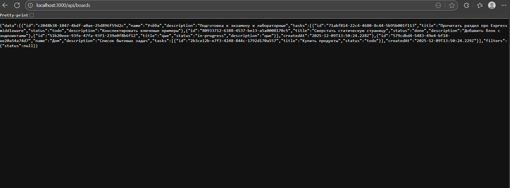

# Мини-канбан на Express.js

Express-приложение с простым API для работы с досками и задачами. Подходит для закрепления навыков маршрутизации, работы с параметрами, middleware и раздачей статики.

## Требования
- Node.js 18+
- npm

## Установка и запуск
```bash
npm install
npm run dev   # с перезагрузкой (nodemon)

```
Сервер по умолчанию поднимается на `http://localhost:3000`.

## Эндпоинты
- `GET /api/boards` — все доски. Поддерживает `?status=todo|in-progress|done` для фильтрации задач внутри досок.
- `GET /api/boards/:boardId` — получить доску. Передайте `?withTasks=true`, чтобы вернуть задачи.
- `POST /api/boards` — создать доску, тело `{ "name": "Учёба", "description": "..." }`.
- `POST /api/boards/:boardId/tasks` — добавить задачу, тело `{ "title": "Сделать", "status": "todo" }`.
- `PUT /api/boards/:boardId/tasks/:taskId` — обновить поля задачи.
- `DELETE /api/boards/:boardId/tasks/:taskId` — удалить задачу.

Все POST/PUT запросы принимают JSON и `application/x-www-form-urlencoded`.

## Архитектура
- `src/server.js` — точка входа (поднимает сервер).
- `src/app.js` — конфигурация Express: `express.json()`, `express.urlencoded()`, статические файлы, маршруты и 404.
- `src/routes/boardRoutes.js` — маршруты API.
- `src/controllers/boardController.js` — логика работы с данными.
- `src/data/store.js` — простое in-memory хранилище.
- `src/middleware/requestLogger.js` — собственный middleware для логов.
- `public/` — статические файлы (доступны без префикса).
- `docs/screenshots/placeholder.svg` — место для вашего реального скрина UI/запросов.

## Примеры запросов
```bash
# Список досок
curl http://localhost:3000/api/boards

# Создать доску
curl -X POST http://localhost:3000/api/boards \
  -H "Content-Type: application/json" \
  -d '{ "name": "Работа", "description": "Проект X" }'

# Добавить задачу (через form-data или urlencoded тоже работает)
curl -X POST http://localhost:3000/api/boards/<boardId>/tasks \
  -H "Content-Type: application/json" \
  -d '{ "title": "Собрать отчёт", "status": "in-progress" }'
```

## Статика
Откройте `http://localhost:3000/`, чтобы увидеть краткую памятку по API. Можно положить туда свои HTML/JS/CSS файлы.

## Скриншоты
- UI/канбан в браузере:  
  
- Api:  
  

